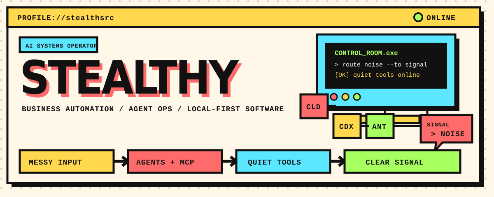
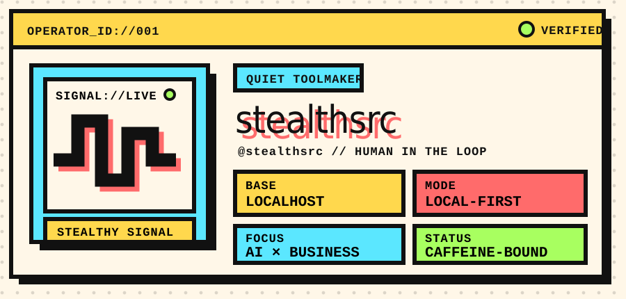
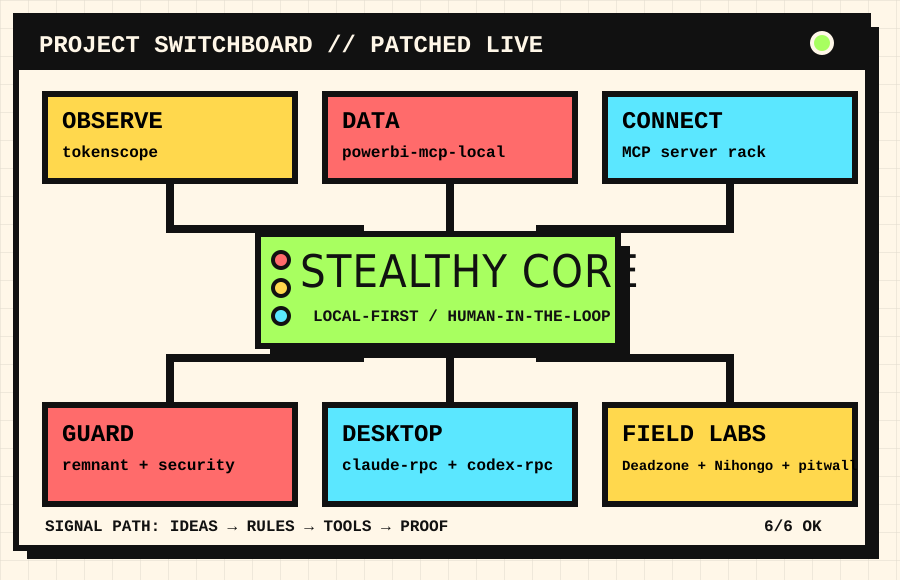

<picture>
  <source media="(max-width: 600px)" srcset="assets/control-room-mobile.svg" />
  
</picture>

 

> ### `MISSION // MAKE THE MESS BORING`
>
> I design automated, AI-assisted workflows that turn messy business processes into dependable systems — MCP servers, agent infrastructure, observability and local-first desktop tools.
>
> **Quiet tools. Useful systems. Clear signal.**

<picture>
  <source media="(max-width: 600px)" srcset="assets/operator-id-mobile.svg" />
  
</picture>

## `01 // FLAGSHIP SYSTEMS`

> ### 📊 `01 / TOKEN OBSERVABILITY` — [tokenscope](https://github.com/stealthsrc/tokenscope)
>
> Local-first usage and subscription tracker for Claude Code and Codex. Costs, quotas and budgets — without telemetry.
>
> `Python` `React` `FastAPI`

> ### 📈 `02 / BUSINESS DATA BRIDGE` — [powerbi-mcp-local](https://github.com/stealthsrc/powerbi-mcp-local)
>
> MCP server for Power BI Desktop: Excel, Power Query, semantic models and visual automation.
>
> `Python` `MCP` `Power BI`

> ### 🛰️ `03 / DESKTOP SIGNAL` — [claude-rpc](https://github.com/stealthsrc/claude-rpc)
>
> Native Discord Rich Presence for Claude Code and Desktop, with tray controls and usage limits.
>
> `Rust` `Tauri` `RPC`

<picture>
  <source media="(max-width: 600px)" srcset="assets/project-switchboard-mobile.svg" />
  
</picture>

## `02 // PROJECT RACKS`

<b>🔌 RACK A — AGENTS CONNECTED TO REAL SYSTEMS</b>

 

| Project | Signal |
| --- | --- |
| [**obsidian-mcp**](https://github.com/stealthsrc/obsidian-mcp) | An Obsidian vault as an external brain for Claude. |
| [**steam-mcp**](https://github.com/stealthsrc/steam-mcp) | Steam profiles, libraries, achievements and store search over MCP. |
| [**mcp-worldoftanks**](https://github.com/stealthsrc/mcp-worldoftanks) | Wargaming.net account analytics for Claude and Gemini. |
| [**gemini-mcp-connect**](https://github.com/stealthsrc/gemini-mcp-connect) | A Gemini second opinion inside Claude Code. What could go wrong? |
| [**codex-discord-mcp**](https://github.com/stealthsrc/codex-discord-mcp) | Discord bot and MCP bridge for the Codex CLI. |

<b>🧠 RACK B — AGENT OPS, MEMORY & GUARDRAILS</b>

 

| Project | Signal |
| --- | --- |
| [**agentops-config-toolkit**](https://github.com/stealthsrc/agentops-config-toolkit) | Compact configs that keep coding agents focused and cheap. |
| [**remnant**](https://github.com/stealthsrc/remnant) | Local-first persistent context for Claude Code, Codex and Gemini CLI. |
| [**security-hardening**](https://github.com/stealthsrc/security-hardening) | Defensive AppSec and AI-agent security skill. |
| [**caveman-lang**](https://github.com/stealthsrc/caveman-lang) | Token survival protocol: less output, same signal. |
| [**prompting-evaluator**](https://github.com/stealthsrc/prompting-evaluator) | Evaluate and optimize prompts with local or hosted models. |
| [**agentic-coding-FR**](https://github.com/stealthsrc/agentic-coding-FR) | Hands-on French guide to Claude Code and Codex. |
| [**ai-edu-skills-FR**](https://github.com/stealthsrc/ai-edu-skills-FR) | ChatGPT and Claude skills for French academic writing. |

<b>🧪 RACK C — DESKTOP TOOLS, LIVE LABS & FIELD TESTS</b>

 

| Project | Signal |
| --- | --- |
| [**codex-rpc**](https://github.com/stealthsrc/codex-rpc) | Native TypeScript/Tauri/Rust Rich Presence for Codex. |
| [**icue-edge-widgets**](https://github.com/stealthsrc/icue-edge-widgets) | Spotify, ISS and dashboard widgets for Corsair XENEON EDGE. |
| [**Deadzone Lab**](https://deadzonelab.vercel.app) | Test and tune PlayStation controller deadzones on PC. |
| [**Nihongo Lab**](https://nippon-study.vercel.app) | Japanese learning from kana to JLPT N1, with SRS. FR/EN. |
| [**osint-terrain**](https://github.com/stealthsrc/osint-terrain) | Provenance-first retrospective terrain analysis. |
| [**Cruise**](https://github.com/stealthsrc/Cruise) | Forza EventLab automation with telemetry and stuck recovery. |
| [**pitwall**](https://github.com/stealthsrc/pitwall) | Forza telemetry overlay for OBS and transparent desktop HUDs. |

## `03 // PATCH PANEL`

**LANGUAGES + DATA**

<kbd>Python</kbd> <kbd>TypeScript</kbd> <kbd>Rust</kbd> <kbd>SQL</kbd> <kbd>PowerShell</kbd> <kbd>VBA</kbd> <kbd>Power BI</kbd> <kbd>Excel</kbd>

**AGENTS + CONTROL**

<kbd>Claude</kbd> <kbd>Anthropic SDK</kbd> <kbd>Codex</kbd> <kbd>Gemini</kbd> <kbd>Cursor</kbd> <kbd>MCP</kbd> <kbd>Prompt evals</kbd> <kbd>Agent memory</kbd> <kbd>AppSec</kbd>

**SHIP + OBSERVE**

<kbd>Tauri</kbd> <kbd>React</kbd> <kbd>FastAPI</kbd> <kbd>Acceptance tests</kbd> <kbd>Agile/Scrum</kbd> <kbd>Documentation</kbd> <kbd>Change management</kbd>

## `04 // OPERATOR LOG`

> **LOG 01** — The agents write the code. I write the rules they break, then the rules that stop them breaking them. The second file is longer.

> **LOG 02** — The tools have better observability than most production systems I've seen. This is either reassuring or deeply concerning.

> **LOG 03** — Claude Code, Codex and Antigravity don't know about each other. [gemini-mcp-connect](https://github.com/stealthsrc/gemini-mcp-connect) exists so they can argue.

<b>🖥️ WORKSTATION SPEC — THE BOX RUNNING THE AGENTS</b>

 

| Part | Spec |
| --- | --- |
| CPU / GPU | AMD Ryzen 7 9800X3D · Gigabyte RTX 5070 Ti AERO 16GB |
| Memory | HyperX FURY Beast RGB 64GB DDR5-6400 CL32 |
| Board / cooling | GIGABYTE AORUS B650E **STEALTH ICE** · Corsair iCUE Link Titan 360 RX |
| Storage | 2× WD SN7100 2TB · Samsung 970 EVO Plus 2TB · WD SA500 4TB |
| Case / PSU | Corsair 4000D Frame White · ASUS ROG Strix 1000W Platinum |

## `05 // LIVE SIGNAL`

 
 

<b>QUIET TOOLS&nbsp;&nbsp;/&nbsp;&nbsp;USEFUL SYSTEMS&nbsp;&nbsp;/&nbsp;&nbsp;CLEAR SIGNAL</b>

 

Humans set constraints. Agents burn tokens. <a href="https://github.com/stealthsrc/tokenscope">tokenscope</a> keeps the receipts.

