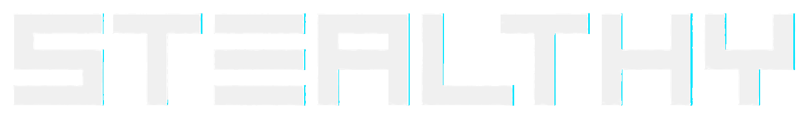

<!-- ╭──────────────────────────────────────────────────────────╮ -->
<!-- │  stealthsrc · profile README                          │ -->
<!-- ╰──────────────────────────────────────────────────────────╯ -->

<div align="center">

<picture>
  <source media="(prefers-color-scheme: dark)" srcset="assets/banner-dark.png">
  <source media="(prefers-color-scheme: light)" srcset="assets/banner-light.png">
  
</picture>

<br>
<br>


<p>
  
  <a href="https://stealthylabs.eu"></a>
  
</p>


</div>

> I design automated, AI-assisted workflows that help business teams gain clarity, reliability and efficiency — MCP servers, agent configs, and quiet tools that turn messy processes into dependable systems.
>
> Most of this was pair-programmed with Claude Code, OpenAI Codex and Google Antigravity. I set the constraints, they burn the tokens — I know exactly how many, because I built [tokenscope](https://github.com/stealthsrc/tokenscope) to watch them do it.

---

## Tech stack

**Languages & data**

<p>
  
  
  
  
  
  
  
  
</p>

**AI & agents**

<p>
  
  
  
  
  
  
  
</p>

**Methods** — Agile/Scrum · acceptance testing · documentation · change management

---

## GitHub at a glance

<div align="center">


</div>

---

## Featured work

MCP servers, agent-ops tooling and quiet automations. ⭐ counts are live.

<details open>
<summary><b>🔌 MCP servers — connect AI agents to real systems</b></summary>
<br>

| Project | What it does | Stars |
| --- | --- | --- |
| [**powerbi-mcp-local**](https://github.com/stealthsrc/powerbi-mcp-local) | MCP server for Power BI Desktop — Excel, Power Query, semantic model & visual automation. |  |
| [**obsidian-mcp**](https://github.com/stealthsrc/obsidian-mcp) | Exposes an Obsidian vault as an external brain for Claude. |  |
| [**steam-mcp**](https://github.com/stealthsrc/steam-mcp) | Steam Web API for Claude Code & Gemini CLI — profiles, library, achievements, store search. |  |
| [**mcp-worldoftanks**](https://github.com/stealthsrc/mcp-worldoftanks) | Wargaming.net account analytics over MCP (Claude / Gemini / Desktop). |  |
| [**gemini-mcp-connect**](https://github.com/stealthsrc/gemini-mcp-connect) | Drive Claude Code with a Google Gemini brain via MCP. |  |
| [**codex-discord-mcp**](https://github.com/stealthsrc/codex-discord-mcp) | Discord bot + MCP bridge for the Codex CLI. |  |

</details>

<details>
<summary><b>🧠 Agent ops, skills & guides — focused, cost-efficient AI</b></summary>
<br>

| Project | What it does | Stars |
| --- | --- | --- |
| [**agentops-config-toolkit**](https://github.com/stealthsrc/agentops-config-toolkit) | Compact config files keeping Claude Code, Gemini CLI & Codex focused and cheap. |  |
| [**prompting-evaluator**](https://github.com/stealthsrc/prompting-evaluator) | Evaluate, score & optimize prompts via Ollama, Gemini or Claude. |  |
| [**remnant**](https://github.com/stealthsrc/remnant) | Local-first persistent context memory for Claude Code, Codex & Gemini CLI. |  |
| [**security-hardening**](https://github.com/stealthsrc/security-hardening) | Defensive AppSec & AI-agent security skill — OWASP, MCP security, prompt injection, threat modeling. |  |
| [**caveman-lang**](https://github.com/stealthsrc/caveman-lang) | Token survival protocol — cut LLM output waste 60–90%. |  |
| [**agentic-coding-FR**](https://github.com/stealthsrc/agentic-coding-FR) | Hands-on French guide to Claude Code & Codex. |  |

</details>

<details>
<summary><b>🖥️ Presence, bots & widgets — desktop & hardware</b></summary>
<br>

| Project | What it does | Stars |
| --- | --- | --- |
| [**claude-rpc**](https://github.com/stealthsrc/claude-rpc) | Native Tauri/Rust Discord Rich Presence for Claude Code & Desktop. |  |
| [**codex-rpc**](https://github.com/stealthsrc/codex-rpc) | Native TS/Tauri/Rust Discord Rich Presence for the Codex CLI. |  |
| [**icue-edge-widgets**](https://github.com/stealthsrc/icue-edge-widgets) | Corsair iCUE widgets for XENEON EDGE / Titan RX — Spotify, ISS, dashboards. |  |

</details>

<details>
<summary><b>🌐 Web apps — live on Vercel</b></summary>
<br>

| Project | What it does | Live | Stars |
| --- | --- | --- | --- |
| [**deadzonelab**](https://github.com/stealthsrc/deadzonelab) | Test & tune PlayStation controller deadzones on PC — drift/jitter analysis, DS4Windows & Steam Input presets. | [deadzonelab.vercel.app](https://deadzonelab.vercel.app) |  |
| [**nippon-study**](https://github.com/stealthsrc/nippon-study) | Nihongo Lab — open-source Japanese learning app: kana, 4000+ kanji, JLPT N5–N1, SRS flashcards. FR/EN. | [nippon-study.vercel.app](https://nippon-study.vercel.app) |  |

</details>

<details>
<summary><b>📡 Data, OSINT & gaming — pipelines and automation</b></summary>
<br>

| Project | What it does | Stars |
| --- | --- | --- |
| [**osint-terrain**](https://github.com/stealthsrc/osint-terrain) | Retrospective OSINT terrain-analysis pipeline, provenance-first open data. |  |
| [**Cruise**](https://github.com/stealthsrc/Cruise) | AFK auto-farm for Forza Horizon EventLab — telemetry, stuck recovery, Discord RPC. |  |

</details>

---

## Field notes

- The agents write the code. I write the rules they break, then the rules that stop them breaking them. That second file is longer.
- I built a token tracker, a context memory, a security skill and two Discord presences for my AI tools. The tools now have better observability than most production systems I've seen.
- Three agents on the payroll — Claude Code, Codex, Antigravity. They don't know about each other. [gemini-mcp-connect](https://github.com/stealthsrc/gemini-mcp-connect) exists so they can argue.
- `quiet tools` is a design philosophy, not a description of my Discord notifications.

## The machine

The rig that runs the agents (and occasionally a game, when the context windows allow it):

| Part | Spec |
| --- | --- |
| CPU | AMD Ryzen 7 9800X3D |
| GPU | Gigabyte GeForce RTX 5070 Ti AERO 16GB GDDR7 |
| Memory | Lexar ARES RGB 32GB (2×16) DDR5-6400 CL32 |
| Motherboard | GIGABYTE AORUS B650E **STEALTH ICE** — it was never really a choice |
| Cooling | Corsair iCUE Link Titan 360 RX — monitored by [icue-edge-widgets](https://github.com/stealthsrc/icue-edge-widgets), naturally |
| Storage | 2× WD SN7100 2TB · Samsung 970 EVO Plus 2TB · WD SA500 4TB |
| Case / PSU | Corsair 4000D Frame White · ASUS ROG Strix 1000W Platinum |

---

<div align="center">

```text
quiet tools - useful systems - clear signal
```

<sub>README co-written with Claude Code. It insisted on this footnote. I let it have this one.</sub>

<p>
  
  <a href="https://twitch.tv/stealthylabs"></a>
</p>

</div>
